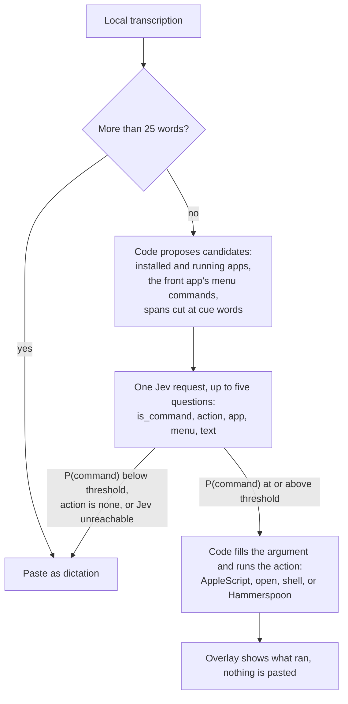

# Voice Commands (experimental, macOS)

Handy normally pastes what you say. With voice commands on, a short dictation can
control your Mac instead: "open Safari", "move this window to the left half",
"search for flights to Denver", "scratch that". Inside the app you're using, it can
run anything in its menus ("show my downloads", "go to my inbox") and click what's on
screen ("click cephalopods", "click the search box", "click this").

## How it decides

Handy still transcribes locally. After that, **Jev decides and code acts**:



The single request to [TypeSafe System One](https://docs.typesafe.ai) (`jev-1.13.0`
by default) asks up to five independent questions:

| Question     | Type   | Asks                                                                                                        |
| ------------ | ------ | ----------------------------------------------------------------------------------------------------------- |
| `is_command` | noul   | Is this an instruction for the computer, or text to type into the frontmost app?                            |
| `action`     | choice | Which listed action, or none                                                                                |
| `app`        | choice | Which installed or running app is named, if any                                                             |
| `menu`       | choice | Which of the front app's menu commands is asked for, if any (only when its menus could be read)             |
| `text`       | choice | Which span of the utterance is the argument (a search query, a site, words to type), from spans cut by code |

Jev never writes a script or an argument. It only picks from lists that code built, so a
misheard command can only run one of the listed actions, with an argument that was said.

Anything that isn't confidently a command is pasted exactly as before. So is everything
when no API key is set or when Jev doesn't answer within 2.5 seconds.

## Setup

1. **Advanced** → turn on **Experimental Features**, then turn on **Voice Commands**.
2. In the new **Voice Commands** page, paste a TypeSafe API key. Alternatively, set
   `TYPESAFE_API_KEY` in the environment Handy is launched from.
3. The first command that uses System Events (keystrokes, hiding apps, dark mode) makes
   macOS ask whether Handy may control System Events. Allow it. Quitting an app, or
   controlling Spotify or Music without Hammerspoon, asks the same for that app.
   Keystrokes also use the Accessibility permission Handy already has for pasting.
4. Optional, for window tiling and media keys: install Hammerspoon.
   - `brew install --cask hammerspoon`, or download it from [hammerspoon.org](https://www.hammerspoon.org).
   - Add `require("hs.ipc")` to `~/.hammerspoon/init.lua` and reload the config.
   - In the Hammerspoon console, install the `hs` command-line tool:
     `hs.ipc.cliInstall("/opt/homebrew")` on Apple Silicon, or `hs.ipc.cliInstall()` on Intel.
   - The Voice Commands page shows **Installed** once `/opt/homebrew/bin/hs` or
     `/usr/local/bin/hs` exists.

## Built-in actions

| Area    | Say something like                                                                                                                              | Runs through                                       |
| ------- | ----------------------------------------------------------------------------------------------------------------------------------------------- | -------------------------------------------------- |
| Apps    | "open Slack", "switch to Safari", "quit Spotify", "hide Messages"                                                                               | `open -a`, AppleScript                             |
| Windows | "minimize this", "full screen", "close this tab"                                                                                                | Keystrokes                                         |
| Windows | "move this window to the left half", "snap it right", "maximize", "center it", "send this to my other monitor"                                  | Hammerspoon only                                   |
| System  | "turn it up", "quieter", "set the volume to 30%", "mute", "lock my computer", "sleep the display", "dark mode", "take a screenshot"             | AppleScript, `pmset`, keystrokes                   |
| Media   | "pause the music", "next song", "previous track"                                                                                                | Media keys with Hammerspoon, else Spotify or Music |
| Web     | "search for flights to Denver", "go to github.com", "open YouTube", "new tab", "reopen that tab", "reload", "go back", "next tab"               | Default browser, keystrokes                        |
| Editing | "scratch that", "redo", "copy that", "cut", "paste", "select all", "save", "find", "press enter", "escape", "delete the last word", "page down" | Keystrokes                                         |
| Typing  | "type hello world"                                                                                                                              | Pastes "hello world", like dictation               |
| Menus   | "show my downloads", "bookmark this page", "go to my inbox", "mark this as unread", "go to threads", "switch to week view"                      | The front app's own menus, through Accessibility   |
| Clicks  | "click cephalopods", "open the talk page", "press the share button", "click the search box", "click this"                                       | Accessibility; "click this" clicks at the pointer  |

"Open YouTube" opens the site when no app by that name is installed. A site name without a
domain ("open the verge") goes to DuckDuckGo's top result.

No built-in action deletes anything, shuts down, or empties the Trash. Commands run as soon
as Jev is confident, without asking first, so keep destructive custom commands out of the
list.

## Menu commands

Every Mac app lists what it can do in its menu bar, so the app in front brings its own
commands. While Handy transcribes, it reads that app's menus through the Accessibility
permission it already has for pasting: every enabled item, up to two submenus deep
("Mailbox > Go To > Inbox"). Jev picks the one you asked for, and Handy presses it as if
you had chosen it from the menu. Built-in actions still handle what they cover, such as
switching apps, new tab or undo.

Some items are never offered:

- The Apple menu, and items that quit, log out, sign out, shut down, restart, erase,
  empty, revert or discard.
- Lists of your own content: Open Recent, Recent Items, Services, Favorites, and in the
  History, Bookmarks and Window menus the page, bookmark and window titles. Only those
  menus' fixed commands are kept: their first section, items with a keyboard shortcut,
  and items that open a dialog (ending in "…").

Items ending in "…" open a dialog rather than acting right away, as they do when clicked.

## Clicking

Say what to click the way it reads on screen: "click cephalopods", "open the talk page",
"press the share button", "click the search box". Or point at something and say "click
this" or "click here".

- **By name:** only when you ask to click something, Handy reads the links, buttons, tabs,
  checkboxes and fields visible in the front window, and a second Jev request picks the
  one you named. Links and buttons are pressed through Accessibility, so the pointer
  doesn't move. Fields get the cursor, ready for dictation. Handy clicks only when Jev is
  at least 50% sure, and it never reads what's typed in a field.
- **Pages:** in a web page, Handy asks for the visible links and controls in one request,
  the way VoiceOver finds links. Safari answers it best. Chrome, Arc and Electron apps
  such as Slack build their page's Accessibility tree only once an app asks for it, which
  Handy does, so the first click there can come up empty.
- **"Click this":** clicks wherever the pointer already is, without moving it.

Try it on Wikipedia in Safari:

1. "go to wikipedia.org"
2. "click the search box", dictate "octopus", then "press enter"
3. "click cephalopods", "go back", "open the intelligence section", "click random article"
4. Point at a picture and say "click this".

## Custom commands

Custom commands live in `voice_commands.json` in Handy's app data directory. **Voice
Commands → Custom Commands → Edit** creates the file from a template and opens it. The file
is read on every command, so edits apply to the next one you speak.

```json
{
  "commands": [
    {
      "id": "standup_notes",
      "title": "Standup notes",
      "description": "Open my daily standup notes",
      "shell": "open ~/Notes/standup.md"
    },
    {
      "id": "focus_on",
      "description": "Turn on focus mode or do not disturb",
      "applescript": "tell application \"Shortcuts Events\" to run shortcut \"Focus On\""
    },
    {
      "id": "search_github",
      "description": "Search GitHub for code or repositories",
      "argument": "text",
      "url": "https://github.com/search?q={text}"
    },
    {
      "id": "editor_and_browser",
      "description": "Put the code editor on the left and the browser on the right",
      "hammerspoon": "hs.layout.apply({{\"Code\", nil, nil, hs.layout.left50, nil, nil}, {\"Safari\", nil, nil, hs.layout.right50, nil, nil}})"
    }
  ]
}
```

| Field         | Required | Meaning                                                                                             |
| ------------- | -------- | --------------------------------------------------------------------------------------------------- |
| `id`          | yes      | Letters, digits, `_` or `-`. Reusing a built-in id (for example `web_search`) replaces that action. |
| `description` | yes      | What Jev reads. Describe what someone would ask for, not how it's done.                             |
| `title`       | no       | Label in the overlay. Defaults to the id.                                                           |
| `not_for`     | no       | Look-alike requests that belong to a different action, to steer Jev away.                           |
| `argument`    | no       | `none` (default), `app`, `text`, or `number`.                                                       |
| one runner    | yes      | Exactly one of `applescript`, `hammerspoon`, `shell`, `url`.                                        |

How each runner receives the argument:

| Runner        | Argument                              |
| ------------- | ------------------------------------- |
| `applescript` | the property `arg`                    |
| `hammerspoon` | the local `arg` (needs the `hs` CLI)  |
| `shell`       | `$1`, run with `/bin/sh -c`           |
| `url`         | `{text}` is replaced, percent-encoded |

Arguments come from speech, so they are always passed as data: an escaped AppleScript string,
a Lua long string, a positional shell parameter, or a percent-encoded URL component. They
never become part of the script.

A file with a mistake is ignored as a whole, and the Voice Commands page shows why.

## Privacy

Handy is local-first, and this feature is not. With voice commands on, every dictation of
25 words or fewer is sent to TypeSafe's API, together with the name of the frontmost app,
the names of its menu commands (without the lists of recent files, history, bookmarks and
windows described above), and the names of your installed and running apps. When you ask
to click something by name, the names of the links, buttons and fields visible in the
front window are sent too. Longer dictations never leave your Mac. Turn the feature off to
keep Handy fully local.

## Tuning and evaluating

- **Command Threshold** (default 0.70) is how sure Jev must be that you spoke a command.
  Raise it if dictation gets run as a command; lower it if commands get pasted as text.
- Each decision is logged at info level, for example
  `Voice command routing: is_command=0.97 action=open_app (0.99) app=Some("Slack") ...`.
  Arguments taken from speech are redacted in release builds.
- A live eval runs 35 commands and 12 command-like dictations ("I think we should close the
  deal...", "Save the date...") through the same request and decision code the app uses, and
  prints the misses, how often dictation ran as a command, and latency. Two more do the same
  for menu commands (Safari, Slack, Mail and Calendar in front) and for clicking (Wikipedia's
  Octopus article in Safari):

  ```sh
  cd src-tauri
  TYPESAFE_API_KEY=... cargo test voice_control::eval -- --ignored --nocapture
  ```

  `VOICE_COMMANDS_THRESHOLD` and `TYPESAFE_MODEL` override the defaults.

## Limitations

- macOS only. The routing code is cross-platform; the actions are not.
- Short dictations wait for one Jev round trip (about 150-300 ms) before they are pasted.
- Commands are saved to History as plain transcripts, so the tray's "Copy last transcript"
  can copy a command's words.
- Keystroke actions send standard macOS shortcuts to the frontmost app. Apps with different
  shortcuts won't respond as expected.
- Some apps, often Electron ones, put little in their menus.
- Clicking reads the front window's controls and visible page content, but not lists and
  tables (message lists, file lists). "Click the first result" works only when the result
  has a name to say.
- Action descriptions are in English, and the History, Bookmarks and Window menus are
  recognized by their English names. Other languages are untested.
